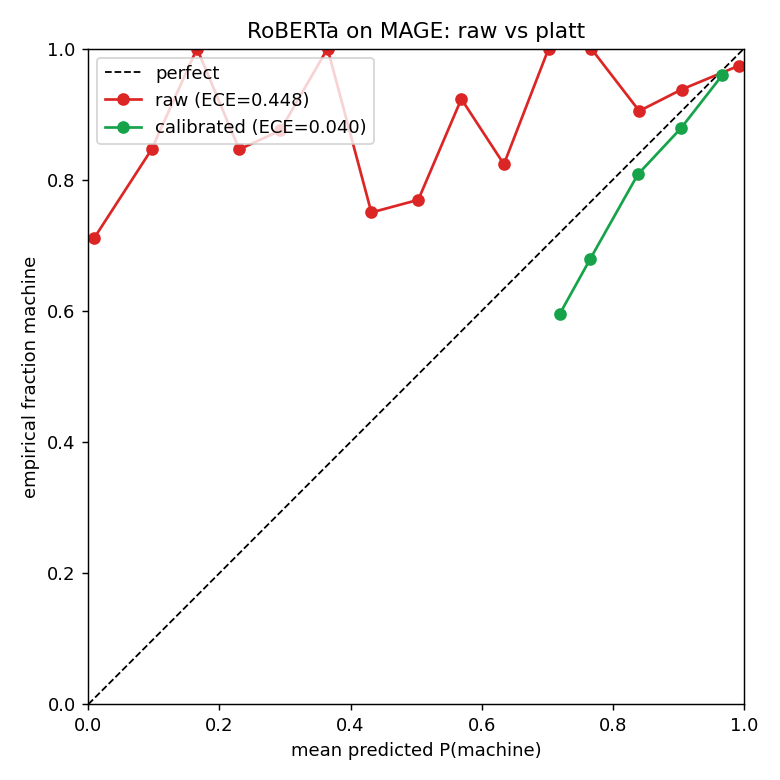

# Calibrated AI-Text Detection

A calibration + fairness-audit layer over one open-weight AI-text detector.

## Result

The RoBERTa AI-text detector is badly overconfident. On a leakage-audited,
group-wise-split slice of MAGE it reports a confidence that is nowhere near its
real accuracy - **ECE 0.448**. A Platt calibrator fit on held-out sources
collapses that to **ECE 0.041** (Brier 0.421 -> 0.123), turning the raw score
into a probability you can trust.



The red curve is the raw detector: it sits far above the diagonal, so a "10%
machine" score really means ~85% machine. The green curve is calibrated: it
hugs the diagonal.

One finding worth its own line: **temperature scaling is not enough here.** The
reflexive fix (a single scalar T) only reaches ECE 0.34, because this slice is
class-imbalanced and needs a *shift*, not just a rescale. Platt and isotonic
(which learn a shift) both clear ECE < 0.05.

## Fairness result

Held to a 10% false-alarm rate on native writers, the detectors still flag most
non-native (TOEFL) writers as machine. On the Liang 2023 essays:

| detector | FPR native | FPR non-native | gap (95% bootstrap CI) |
|---|---|---|---|
| GPT-2 log-perplexity (weak control) | 10.2% | 56.0% | **+45.8%** [+33.7%, +57.9%] |
| RoBERTa | 10.2% | 61.5% | **+51.3%** [+39.1%, +63.4%] |

Both CIs exclude 0, so the gap is real, not noise, at n~91/88. The perplexity
detector is a deliberate positive control: it is exactly the mechanism the bias
literature indicts (non-native text has higher perplexity), so it must show a
gap - and it does, which is how we know the audit catches a real one.

Reproduce:

```bash
uv run python -m aitcal.scripts.run_m3 --detector perplexity
```

Reproduce:

```bash
uv sync --extra dev
uv run python -m aitcal.scripts.run_m2 --limit 1500   # default calibrator: platt
```

## What this is

Open AI-text detectors emit an overconfident, uncalibrated score that no
benchmark measures for reliability or subgroup fairness. This project:

1. **Calibrates** one open detector (RoBERTa, whose raw logit we own) to a
   probability with a known error rate - ECE/Brier + reliability diagram on a
   group-wise-split MAGE pool.
2. **Audits** its native-vs-non-native false-positive gap with bootstrap
   confidence intervals on the Stanford TOEFL set, including a deliberately weak
   log-perplexity detector as a positive control.

## Status

- [x] M1 - `DetectorPort` + RoBERTa adapter emitting raw logits (smoke-tested).
- [x] M2 - Calibrator (temperature / Platt / isotonic) + reliability diagram;
      ECE 0.448 -> 0.041 on a group-wise-split MAGE pool.
- [x] M3 - Fairness audit: native-vs-non-native FPR gap + bootstrap CIs on the
      Liang 2023 TOEFL/Hewlett essays, with a weak log-perplexity positive control.

Future work (deliberately cut): third-party API adapter, per-subgroup ECE,
conformal abstention, serving API, a fine-tuned model.

## Setup

```bash
uv sync --extra dev
uv run pytest            # M1 smoke + M2 unit tests
```

First run of the M2 script downloads `openai-community/roberta-base-openai-detector`
and a MAGE slice.

## Layout

```
src/aitcal/
  detectors/port.py         # DetectorPort protocol (the one interface)
  detectors/roberta.py      # RoBERTa adapter -> raw logit
  detectors/perplexity.py   # GPT-2 log-perplexity (weak fairness positive control)
  calibration/calibrator.py # temperature / Platt / isotonic
  eval/metrics.py           # ECE, Brier
  eval/reliability.py       # before/after reliability diagram
  eval/fairness.py          # per-group FPR + bootstrap CI on the gap
  data/mage.py              # MAGE loader + group-wise split + leakage audit
  data/toefl.py             # Liang 2023 TOEFL/Hewlett fairness essays
  data/sample.py            # tiny labeled sample for the M1 smoke test
  scripts/run_m2.py         # end-to-end M2: score -> split -> calibrate -> report
  scripts/run_m3.py         # end-to-end M3: FPR gap + bootstrap CI audit
tests/                      # smoke (M1) + calibration (M2) + fairness (M3)
```
