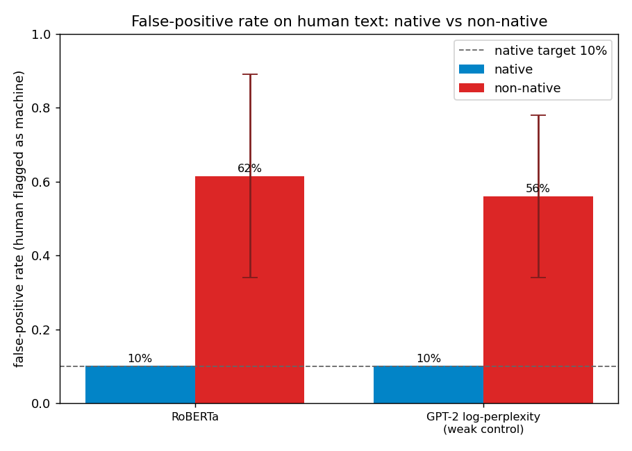

# Calibrated AI-Text Detection

**Turn an AI-text detector people trust blindly from ECE 0.45 to 0.04, and
measure who it is unfair to - with the uncertainty stated out loud.**

Open AI-text detectors output a confident-looking score that no public benchmark
checks for reliability or subgroup fairness, yet that score is already used to
accuse real people. This project wraps one open-weight detector (RoBERTa, whose
raw logit we own) in a thin layer that (1) calibrates its score into an honest
probability and (2) audits its false-positive gap between native and non-native
English writers. Two results, both reproducible, both leakage-audited.

## Result 1 - calibration

The raw RoBERTa detector is badly overconfident. On a leakage-audited,
group-wise-split slice of MAGE its stated confidence is nowhere near its real
accuracy: **ECE 0.448**. A Platt calibrator fit on held-out sources collapses
that to **ECE 0.041** (Brier 0.421 -> 0.123).


The red curve (raw) sits far above the diagonal: a "10% machine" score really
means ~85% machine. The green curve (calibrated) hugs the diagonal.

**Temperature scaling is not enough here.** The reflexive one-scalar fix only
reaches ECE 0.34, because this slice is class-imbalanced and needs a *shift*, not
just a rescale. Platt and isotonic (which learn a shift) both clear ECE < 0.05.

```bash
uv run python -m aitcal.scripts.run_m2 --limit 1500   # default calibrator: platt
```

## Result 2 - fairness

Held to a 10% false-alarm rate on native writers, both detectors still flag most
non-native (TOEFL) writers as machine. On the Liang 2023 essays (91 non-native
TOEFL + 88 native Hewlett, all human):

| detector | FPR native | FPR non-native | gap (95% bootstrap CI) |
|---|---|---|---|
| GPT-2 log-perplexity (weak control) | 10.2% | 56.0% | **+45.8%** [+23.8%, +67.8%] |
| RoBERTa | 10.2% | 61.5% | **+51.3%** [+23.9%, +78.8%] |

Both CIs exclude 0, so the observed gap is not noise at n~91/88 (95% bootstrap CI,
with the native-anchored threshold refit inside every resample so the interval
carries the operating-point uncertainty too). The GPT-2 log-perplexity detector
is a deliberate positive control: non-native writing has higher perplexity, so a
perplexity detector *must* penalize it. It does - which is how we know the audit
catches a real gap rather than inventing one.



The blue bars are pinned at the 10% native target; the red bars (non-native) tower
over it, whiskers showing the bootstrap CI on the gap - well clear of parity.

```bash
uv run python -m aitcal.scripts.run_m3 --detector perplexity
uv run python -m aitcal.scripts.make_fairness_chart      # regenerate the chart
```

## How it holds up (methodology notes)

Two choices that make the numbers honest rather than flattering:

- **Leakage audit is a first-class output.** MAGE is split by `src` (domain +
  generator) so no generator appears in both the calibration and test set, and an
  overlap-hash check asserts the split is clean before any metric is reported.
  Cross-source contamination silently inflates every calibration number
  otherwise.
- **The fairness threshold is native-anchored, not median.** A combined-median
  cut inflates both groups' absolute FPRs toward 50% by construction, so the
  audit reports at a native-anchored operating point (tune the cut so native FPR
  is ~10%, then read off non-native). The gap is the signal; the absolute rates
  are stated with their operating point, never quoted bare.

Data label orientations were verified from live rows, not assumed: MAGE labels
human as 1 (we flip to 1 = machine); the RoBERTa checkpoint is `{0: Fake, 1:
Real}` (read from config, not hardcoded).

## Novelty

No public AI-text-detector benchmark (MAGE, RAID) reports ECE or a subgroup
fairness gap. Closest prior work, cited and differentiated: MCP (ACL 2025,
conformal-for-FPR, not calibration) and Markov-Informed Calibration (token-level
score refinement, not confidence calibration). The composition of calibration +
subgroup fairness with reliability diagnostics is unoccupied.

## Milestones

- [x] **M1** - `DetectorPort` + RoBERTa adapter emitting raw logits (smoke-tested).
- [x] **M2** - Calibrator (temperature / Platt / isotonic) + reliability diagram;
      ECE 0.448 -> 0.041 on a group-wise-split MAGE pool.
- [x] **M3** - Fairness audit: native-vs-non-native FPR gap + bootstrap CIs on the
      Liang 2023 TOEFL/Hewlett essays, with a weak log-perplexity positive control.

Deliberately cut to future work: third-party API adapter (an opaque "% AI" is not
a logit you can calibrate), per-subgroup ECE (n~91 cannot support the bins),
conformal abstention with a stated risk guarantee, a serving API, and a
fine-tuned own-model proven on the same harness.

## Setup

```bash
uv sync --extra dev
uv run pytest            # M1 smoke + M2 calibration + M3 fairness (12 tests)
```

The M2 and M3 scripts download `openai-community/roberta-base-openai-detector`
(and `gpt2` for the perplexity control), a MAGE slice, and the Liang essays on
first run; datasets are cached locally and git-ignored.

## Layout

```
src/aitcal/
  detectors/port.py         # DetectorPort protocol (the one interface)
  detectors/roberta.py      # RoBERTa adapter -> raw logit
  detectors/perplexity.py   # GPT-2 log-perplexity (weak fairness positive control)
  calibration/calibrator.py # temperature / Platt / isotonic
  eval/metrics.py           # ECE, Brier
  eval/reliability.py       # before/after reliability diagram
  eval/fairness.py          # per-group FPR + bootstrap CI on the gap
  eval/fairness_plot.py     # native vs non-native FPR bar chart
  data/mage.py              # MAGE loader + group-wise split + leakage audit
  data/toefl.py             # Liang 2023 TOEFL/Hewlett fairness essays
  data/sample.py            # tiny labeled sample for the M1 smoke test
  scripts/run_m2.py         # end-to-end M2: score -> split -> calibrate -> report
  scripts/run_m3.py         # end-to-end M3: FPR gap + bootstrap CI audit
  scripts/make_fairness_chart.py  # render docs/fairness.png across both detectors
tests/                      # smoke (M1) + calibration (M2) + fairness (M3)
```
